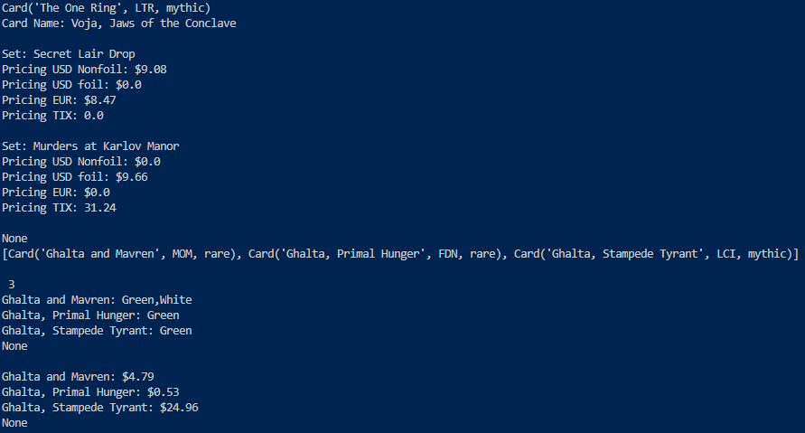

# Magic Projects 🃏

A Python toolkit for Magic: The Gathering - Card Searching, price tracking, collection management, and deck analysis! It'll be used for multiple formats. I'm just working out the kinks. This is my very first full-fledged project that I feel confident in releasing and showing my progress with.

## Overview

This project is a growing collection of MTG tools built around the Scryfall API, planned to eventually become a full web application! For now, MAgic Projects will be its name.

### Current Features

- Card Search with full pagination
- All printings lookup with pricing (USD foil/nonfoil, EUR and TIX)
- Color Identity lookup
- Price comparison across printings

### Planned Features

- Collection Tracker
- Price tracker with alerts
- Deck builder and analyzer (Better EDHRec/will work for any format)
- Web interface (FastAPI + HTML/CSS)

## Built With

- Python
- Scryfall API
- requests library (pulling data)
- pandas (Parse data)
- PostgreSQL (Planned)
- FastAPI (Planned)

## Project Structure

```
Magic-Projects/
    classes/
        card.py            # Card class mapping Scryfall API fields
    Functions/
        ScryFunctions.py   # All API interaction functions
    main.py                # Entry point to program
    requirements.txt       # Holds all libraries needed for program
```

## Setup
1. Clone the repo
2. Create a virtual environment:
    > python -m venv .venv
3. Activate it:
    - Windows: `.venv\Scripts\activate`
    - Mac/Linux: `source .venv/bin/activate`
4. Install dependencies: 
    > pip install -r requirements.txt
5. Run: `python main.py`

### Using uv package/project manager (for Python 3.14+ environments)
1. Clone the repo
2. Run:
    > uv venv
    > uv pip install -r requirements.txt
    > python main.py

## A Note on the Project

This IS something I'm passionate about. I love Magic: The Gathering. I also love to code. Coding has been my passion for over a decade, but I've always been shy of showcasing my work. This project will be maintained and developed as my personal learning project and portfolio piece. Above all, this is a project I'm really passionate in making!

I hope whoever uses this enjoys it~

## Sample Output


The current program demonstrates:
- Exact card lookup by name
- All physical printings with pricing (USD, EUR, TIX)
- Multi-card search with result count
- Color identity display
- Price listing across search results